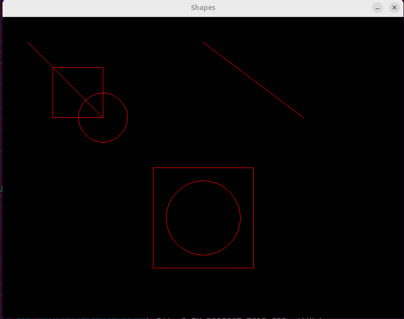

# Lab 4: c++ Relations (Association, Aggregation, Composition)

## Objectives:

- Learn about C++ AOV.

- Learn about C++ Relations (Association, Aggregation, Composition).

- Practice with C++ graph library.

- Practice with C++ Relations.

## Tasks:

1. Make a `Picture` class with different shapes to be drawn.



## Notes:

- You can build (compile) the lab using

```bash
g++ -o main main.cpp -lSDL2.
```

- Run it with

```bash
./main
```
