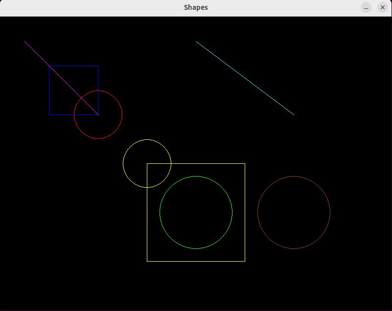

# Lab 5: C++ Relations (Inheritance)

## Objectives:

- Learn about C++ Relations (Inheritance).

## Tasks:

1. Test Base, Derived, and SecondDerived variables accessibility.

2. Make a `Picture` class with different shapes to be drawn with base shape class.



## Notes:

- You can build (compile) the lab using

```bash
g++ -o main main.cpp -lSDL2.
```

- Run it with

```bash
./main
```
